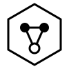

# Noema logo

Three SVG files, all monochrome, all using `currentColor` so they
take the surrounding text color.

## `noema-mark.svg`

The primary mark. Three nodes in a hexagonal frame. Two filled
(confident values), one hollow (the ⊥, first-class refusal).
Three edges showing descent from confident values to the
refusing node. The hexagon evokes content addressing without
literalizing a hash.

Read it as: *a graph of thought, one node of which is refusing,
contained within a stable identity.*

Use at 48px or larger.

## `noema-wordmark.svg`

The mark paired with "noema" set in lowercase monospace. Use on
README headers, documentation pages, and anywhere the project
name needs to appear next to the mark. Lowercase because Noema
is a language, not a product — lowercase reads as technical
rather than promotional.

## `noema-favicon.svg`

Simplified variant for 16×16 / 32×32 rendering. Drops the
hexagonal frame, keeps the three-node graph at high contrast.
The hollow node is retained — it is the signature element that
distinguishes Noema from a generic network logo.

## Color

Every mark ships monochrome. Callers tint via CSS:

```html
<div style="color: #0066cc;">
  
</div>
```

Deliberately no official color. A language, unlike a product,
does not need brand chrome. Pick the color that fits the context.

## What the mark is not

- Not a Greek letter (no literal ν or Ν).
- Not an eye or a brain (too generic for an AI-adjacent project).
- Not a circuit board, a neural net, or a molecule (all overused).
- Not animated, gradient, or glossy.

The design encodes what Noema actually is — a typed hypergraph
with first-class refusal — rather than what an AI logo is
expected to look like.

## Attribution

Designed in this repository by Claude (Anthropic) on behalf of
the Noema project stewarded by Douglas Jones. Released under the
same MIT license as the rest of the codebase.
